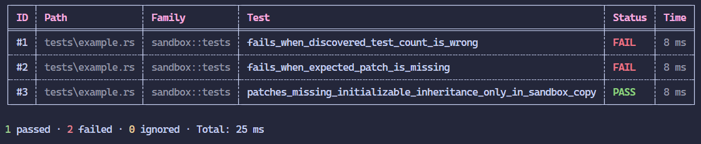
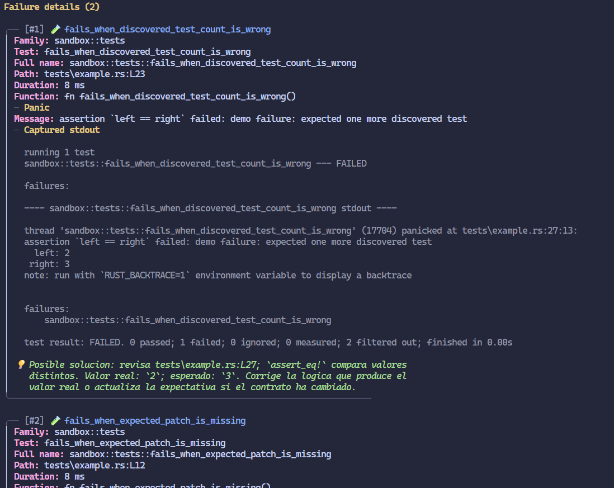

<!--<p align="center">
  
</p>-->

<h1 align="center">Cargo Tester</h1>

<p align="center">
  Subcomando de Cargo para ejecutar tests de Rust más eficientes.
</p>

<p align="center">
  <a href="https://github.com/Roger08G/cargo-tester/actions/workflows/ci.yml"></a>
  <a href="https://github.com/Roger08G/cargo-tester/releases"></a>
  <a href="https://github.com/Roger08G/cargo-tester/stargazers"></a>
  <a href="https://github.com/Roger08G/cargo-tester/network/members"></a>
  
  <a href="LICENSE"></a>
</p>

`cargo-tester` es un subcomando de Cargo para ejecutar tests de Rust y convertir
sus resultados en una salida clara, medible y útil tanto en terminal como en CI.

Ejecutar los tests:

```console
cargo tester
```



Ver los detalles de los tests fallidos:

```console
cargo tester --details
```



## Características

- Tabla estable con archivo, familia, nombre, estado y duración.
- Filtros por nombre, familia, grupo y último resultado fallido.
- Ejecución paralela configurable con grupos que pueden forzarse a secuencial.
- Detalles de panic con archivo, línea, función, salida capturada y contexto.
- Diagnósticos deterministas para fallos comunes de Rust.
- Historial acotado y detección de regresiones de rendimiento.
- Reportes persistentes en texto plano y JSON.
- Salida específica para CI y anotaciones automáticas en GitHub Actions.
- Compatibilidad con workspaces, features y selecciones habituales de Cargo.

## Requisitos

- Rust `1.85` o posterior.
- Cargo disponible en `PATH`.
- Un proyecto o workspace Rust con tests compilables.

## Instalación

Desde GitHub:

```console
cargo install --git https://github.com/Roger08G/cargo-tester --locked
```

Desde una copia local del repositorio:

```console
cargo install --path . --locked
```

También se pueden descargar binarios desde
[GitHub Releases](../../releases/latest) cuando exista una versión publicada.

Después de instalarlo, el comando queda disponible globalmente:

```console
cargo tester --help
```

## Inicio rápido

Ejecutar todos los tests:

```console
cargo tester
```

Filtrar por nombre completo, módulo o parte del nombre:

```console
cargo tester parser::tests
cargo tester parses_a_valid_document
```

Mostrar únicamente las filas fallidas:

```console
cargo tester --failed
```

Obtener información estructurada de los fallos:

```console
cargo tester --details
cargo tester --details --failed
```

Repetir los tests que fallaron en la ejecución anterior:

```console
cargo tester --last-failed
cargo tester --last-failed --details
```

`--last-failed` conserva también las opciones de Cargo y del harness necesarias
para reproducir la selección anterior.

## Comandos

| Opción | Descripción |
| --- | --- |
| `[FILTER]` | Selecciona tests cuyo nombre contiene el filtro. |
| `--details` | Muestra detalles de los fallos y genera `details.json`. |
| `--failed` | Muestra solo fallos en la tabla, manteniendo los totales reales. |
| `--last-failed` | Ejecuta los tests fallidos de la última ejecución. |
| `--group <NAME>` | Ejecuta un grupo definido en `tester.toml`. |
| `--history` | Muestra el historial sin ejecutar tests. |
| `--ci` | Fuerza salida ASCII y genera artefactos aptos para CI. |
| `--no-color` | Desactiva los colores ANSI. |
| `-h`, `--help` | Muestra la ayuda. |
| `-V`, `--version` | Muestra la versión instalada. |

### Opciones de Cargo

Las opciones de compilación se escriben antes del filtro. Se admiten las
selecciones habituales, entre ellas `--workspace`, `--package`, `--features`,
`--all-features`, `--no-default-features`, `--lib`, `--test`, `--all-targets`,
`--release`, `--target`, `--profile`, `--locked` y `--offline`.

```console
cargo tester --workspace --all-features
cargo tester --test integration login
cargo tester --package api --features metrics auth::tests
```

### Opciones del harness

Los argumentos escritos después de `--` se pasan al harness de tests:

```console
cargo tester api::tests -- --nocapture
cargo tester -- --include-ignored
cargo tester -- --test-threads=1
```

`--exact`, `--list`, `--skip`, `--format` y `--color` están reservados porque
`cargo-tester` los utiliza para descubrir y clasificar cada test.

## Configuración

La configuración se busca en este orden:

1. `tester.toml` en la raíz del proyecto.
2. `.cargo/tester.toml`.

Si no existe ninguno, se utilizan valores seguros por defecto.

```toml
[output]
color = true
unicode = true
emoji = false
solution = true
output-path = ".cargo/tester-output/"
show-passed = true
show-failed = true
show-ignored = true
max-width = 140

[execution]
# 0 utiliza el paralelismo disponible; 1 fuerza ejecución secuencial.
jobs = 0

[timing]
slow-threshold = "1s"
very-slow-threshold = "5s"

[history]
enabled = true
max-runs = 50
show-runs-history = 20
regression-threshold-percent = 50
minimum-test-duration = "100ms"

[groups.parser]
patterns = ["parser::*", "ast::*"]

[groups.integration]
patterns = ["integration::*"]
sequential = true
```

### Salida

- `color`: activa ANSI cuando stdout es una terminal y `NO_COLOR` no está
  definido.
- `unicode`: usa bordes Unicode. Los reportes persistentes siempre son ASCII.
- `emoji`: habilita iconos en recomendaciones y detalles.
- `solution`: añade una recomendación determinista a cada fallo detallado.
- `output-path`: directorio donde se guardan los artefactos.
- `show-passed`, `show-failed`, `show-ignored`: controlan las filas visibles.
- `max-width`: limita el ancho de la tabla; el mínimo permitido es `60`.

Las opciones de visibilidad nunca alteran el resumen ni el código de salida.

### Ejecución y grupos

`jobs = 0` utiliza el paralelismo disponible. Un valor positivo fija el número
máximo de procesos simultáneos. Los tests de un grupo con `sequential = true`
se ejecutan sin concurrencia, apropiado para recursos compartidos como puertos o
archivos temporales globales.

Los patrones de grupos utilizan globbing sobre el nombre completo del test:

```console
cargo tester --group parser
```

### Historial y regresiones

`history.json` conserva como máximo `max-runs` ejecuciones. `cargo tester
--history` muestra las últimas `show-runs-history`.

Una regresión se informa cuando un test que superaba
`minimum-test-duration` aumenta al menos el porcentaje configurado en
`regression-threshold-percent`. Solo se comparan ejecuciones correctas.

## Detalles y diagnósticos

Con `--details`, cada fallo incluye:

- ID, familia, nombre completo y duración.
- Archivo y línea de definición del test.
- Ubicación exacta y mensaje del panic.
- Salida estándar y salida de error capturadas.
- Aserción detectada y valores comparados cuando están disponibles.
- Contexto de código alrededor de la línea del fallo.
- Comandos para repetir el test.

Con `solution = true`, el analizador reconoce aserciones, `Option` y `Result`,
índices fuera de rango, overflow, división por cero, conflictos de `RefCell`,
mutex envenenados, canales cerrados, variables de entorno, archivos ausentes,
snapshots, contratos `should_panic`, stack overflow y código sin implementar.

Las recomendaciones se generan a partir de evidencia observable. Si no existe
información suficiente, el diagnóstico se marca como genérico.

## Archivos generados

Con la ruta por defecto:

```text
.cargo/tester-output/
|-- summary.txt
|-- details.json
|-- history.json
`-- last-run.json
```

| Archivo | Contenido |
| --- | --- |
| `summary.txt` | Última tabla en ASCII y sin secuencias ANSI. |
| `details.json` | Reporte estructurado de tests, fallos y contexto. |
| `history.json` | Historial acotado de estados y duraciones. |
| `last-run.json` | Fallos y argumentos necesarios para `--last-failed`. |

`details.json` se genera con `--details` o `--ci`. En una ejecución normal se
elimina para evitar que un reporte antiguo parezca actual.

## Integración continua

`--ci` desactiva colores, Unicode y emojis, y siempre genera `details.json`:

```console
cargo tester --ci --workspace --all-features
```

Cuando `GITHUB_ACTIONS` está definido, cada fallo se publica además como una
anotación con archivo, línea, nombre y mensaje.

Este repositorio incluye:

- CI en Linux, Windows y macOS.
- Comprobación del MSRV declarado (`1.85`).
- Formato, Clippy, tests, empaquetado y prueba end-to-end.
- Publicación de reportes como artefactos de GitHub Actions.
- Construcción de binarios al crear tags `v*`.
- Dependabot para Cargo y GitHub Actions.

## Desarrollo

```console
cargo fmt --all -- --check
cargo test --locked
cargo clippy --all-targets --all-features -- -D warnings
cargo package --locked
```

`tests/example.rs` contiene dos fallos demostrativos desactivados por defecto.
Para validar visualmente el reporte completo:

```console
cargo tester --features demo-failures --details --group sandbox
```

Sin `demo-failures`, esos tests quedan ignorados y la suite permanece en verde.

## Arquitectura

```text
src/
|-- app.rs              Orquestación de una ejecución
|-- cli.rs              Argumentos de tester, Cargo y libtest
|-- config.rs           Carga y validación de tester.toml
|-- runner.rs           Descubrimiento y ejecución paralela
|-- source.rs           Resolución de archivo, función y línea
|-- diagnostics/        Clasificación determinista de fallos
|-- history.rs          Historial y regresiones
|-- state.rs            Estado de la última ejecución
`-- reporter/           Tabla, detalles, JSON, CI e historial
```

Consulta [CONTRIBUTING.md](CONTRIBUTING.md) para preparar cambios y
[SECURITY.md](SECURITY.md) para reportar problemas de seguridad.

## Licencia

Este proyecto se distribuye bajo la [licencia MIT](LICENSE).
